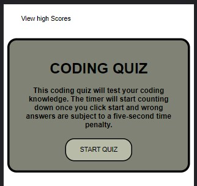

# code-quiz
a browser app containing a multiple choice coding quiz

## Description
This is a timed quiz that keeps score while you answer questions and allows you to add your high score at the end. 

## Installation
Website is available here: https://llangerud.github.io/code-quiz and looks like this:

## Usage
When the "Start Quiz" button is clicked, the user will be given their first multiple choice question of eight total. Once they click their answer selection, the next question is displayed along with whether or not their answer to the previous question was right or wrong (at the bottom of the card). If a wrong answer was clicked, five seconds are subtracted from the timer. Once the timer reaches zero, or all the questions have been answered the user is prompted to enter their initials. Upon submission of their initials, they will see their score, along with any previous scores. They can then clear the scores if they choose, or play again. At any point during the game, "View High Scores" is available, which will display all stored previous scores. 

## Future Improvements
Currently, the high score display for this application is very rudimentary. In the future, I would like to update how this data is pulled and displayed. 

Credits
N/A

License
See License
